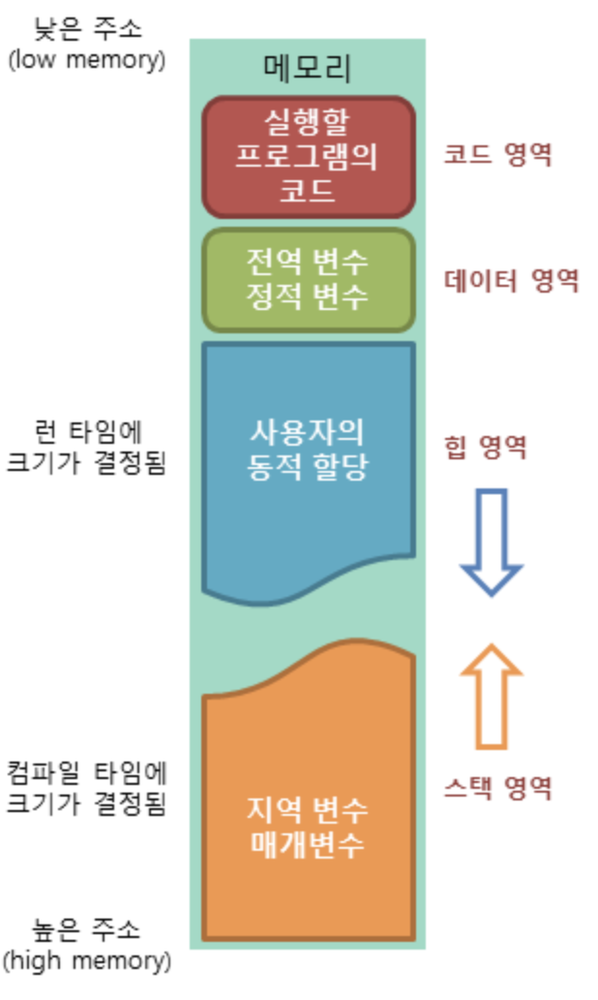

# **get_next_line**

## **get_next_line 소개**
~~~c
char    *get_next_line(int fd);
~~~
> 특정 fd 안에 저장되어 있는 내용을 한줄 씩 읽어서 반환하는 함수를 만드는 과제

## **get_next_line 과제 요구 조건**
    1. 파일 안에 내용을 전부 읽을 때 까지 어디까지 반환했는지 기억해야 함
    2. 파일 안에 내용을 다 읽으면 NULL를 반환 
    3. 여러 fd 들을 관리할 수 있어야 함

## **get_next_line 활용 이론**
### **메모리의 구조**
>   
> 컴퓨터 운영체제는 다음과 같은 메모리 공간을 제공
> 1. 코드(code) 영역
> 2. 데이터(data) 영역
> 3. 스택(stack) 영역
> 4. 힙(heap) 영역

1. 코드 영역 : 우리가 작성한 소스코드가 들어 가는 부분. 즉, 실행할 프로그램의 코드가 저장되는 영역으로 텍스트(code)영역이라고도 부른다. 
코드영역은 실행 파일을 구성하는 명령어들이 올라가는 메모리 영역으로 함수, 제어문, 상수 등이 여기에 지정된다. 
    
2. 데이터 영역 : 전역변수와 static변수가 할당되는 영역 
프로그램의 시작과 동시에 할당되고, 프로그램이 종료되어야 메모리가 소멸되는 영역 
데이터 영역에서 초기화 없이 변수가 선언이 되면 자동으로 0 값을 초기화 시켜준다. 
    
3. 스택 영역 : 프로그램이 자동으로 사용하는 임시 메모리 영역이다. 
함수 호출 시 생성되는 지역 변수와 매개변수가 저장되는 영역이고, 함수 호출이 완료되면 사라진다. 
    
4. 힙 영역 : 프로그래머가 할당/해제하는 메모리 공간이다. Java에서는 가비지 컬렉터가 자동으로 해제합니다. 
이 공간에 메모리 할당하는 것을 동적 할당(Dynamic Memory Allocation)이라고도 부른다. 
    
위의 HEAP과 STACK영역은 사실 같은 공간을 공유한다. HEAP이 메모리 위쪽 주소부터 할당되면 STACK은 아래쪽부터 할당되는 식이다.  
그래서 각 영역이 상대 공간을 침범하는 일이 발생할 수 있는데 이를 각각 HEAP OVERFLOW, STACK OVERFLOW라고 칭한다. 

Stack 영역이 크면 클 수록 Heap 영역이 작아지고, Heap 영역이 크면 클수록 Stack 영역이 작아진다. 

### **fd (file discrupter)**
유닉스 시스템에서는 객체들을 모두 파일이라고 하는데, 파일에 접근할 때, 이 fd값을 이용하여 파일을 지칭함
파일에 접근하면 커널은 fd값중 사용하지 않는 가장 작은 값을 할당한다. 기본적으로 할당되는 fd값은 0 1 2 인데
각각 표준입력, 표준출력, 표준에러라고 한다.

> 1) 표준 입력 [0 - stdin]  
>   키보드로 명령어를 치고 엔터를 이용해 입력하는 방식을 의미한다. 파일 디스크립터에서 0번으로 지정된다.  
> 2) 표준 출력 [1 - stdout]  
>   키보드로 명령어를 실행하고 정상 종료 시 출력되는 내용을 의미한다. 파일 디스크립터에서 1번으로 지정된다.  
> 3) 표준 에러 [2 - stderr]  
>   명령어 실행 시 발생한 에러 메시지 내용을 의미한다. 파일 디스크립터에서 2번으로 지정된다.